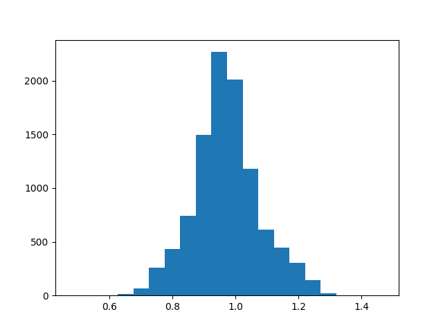
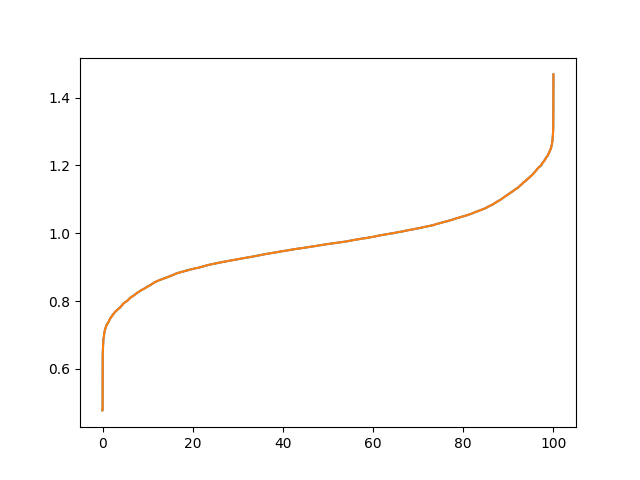
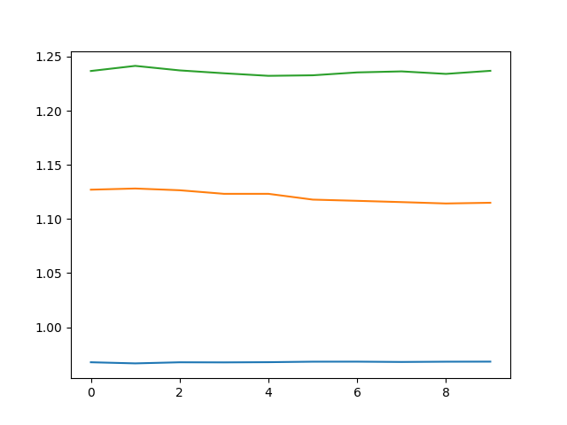
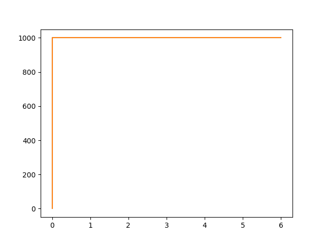

[](https://crates.io/crates/concurrency-demo-benchmarks)


### Overview

A small utility to benchmark different approaches for building concurrent applications.

#### Pre-requisites

1. `cargo` - https://www.rust-lang.org/tools/install
1. `python3.6+` with `matplotlib`

It generates the following files in the current directory:

* `latency_histogram_{name}.png` - X-axis latency in ms, Y-axis - counts for buckets

* `latency_percentiles_{name}.png` - X-axis - 0..100. Y-axis - latency percentile in ms

* `latency_timeline_{name}.png` - X-axis - a timeline in seconds, Y-axis - latency in ms, p50, p90 and p99

* `request_rate_{name}.png` - X-axis - a timeline in seconds, Y-axis - effective RPS (successes only)


where `{name}` is the `--name` (or `-N`) parameter value.

You may need to use `--pythob`/`-p` parameter to specify `python3` binary, if it's not in `/usr/local/bin/python3`. E.g.

```
concurrency-demo-benchmarks --name async_30s \
                            --rate 1000 \
                            --num_req 100000 \
                            --latency "200*9,30000" \
                            --python /usr/bin/python3 \
                            async
```

#### Installation

```
cargo install concurrency-demo-benchmarks  
```


#### Run batched/atomic/mutex increments benchmark
```
git clone https://github.com/xnuter/concurrency-demo-benchmarks.git
cargo bench
```

#### Command line options

```
A tool to model sync vs async processing for a network service

USAGE:
    concurrency-demo-benchmarks [OPTIONS] --name <NAME> --rate <RATE> --num_req <NUM_REQUESTS> --latency <LATENCY_DISTRIBUTION> [SUBCOMMAND]

FLAGS:
    -h, --help       Prints help information
    -V, --version    Prints version information

OPTIONS:
    -l, --latency <LATENCY_DISTRIBUTION>    Comma separated latency values. E.g. 200,200,200,500
    -N, --name <NAME>                       Name of the test-case
    -n, --num_req <NUM_REQUESTS>            Number of requests. E.g. 1000
    -p, --python_path <PYTHON_PATH>         Optional path to python3, e.g. /usr/bin/python3
    -r, --rate <RATE>                       Request rate per second. E.g. 100 or 1000

SUBCOMMANDS:
    async    Model a service with Async I/O
    help     Prints this message or the help of the given subcommand(s)
    sync     Model a service with Blocking I/O

```

Output example:
```
Latencies:
p0.000 - 0.477 ms
p50.000 - 0.968 ms
p90.000 - 1.115 ms
p95.000 - 1.169 ms
p99.000 - 1.237 ms
p99.900 - 1.295 ms
p99.990 - 1.432 ms
p100.000 - 1.469 ms
Avg rate: 1000.000, StdDev: 0.000
``` 

#### Run sync demo
* 1000 rps
* 20ms latency, 10 endpoints
* 500 threads
```
concurrency-demo-benchmarks --name sync_t500_20ms \
                            --rate 1000 \
                            --num_req 10000 \
                            --latency "20*10" \
                            sync --threads 500
```

* 1000 rps
* 60ms latency (stable)
* 500 threads
```
concurrency-demo-benchmarks --name sync_t500_60ms \
                            --rate 1000 \
                            --num_req 10000 \
                            --latency "60*10" \
                            sync --threads 500
```

* 1000 rps
* 20ms latency but 30s for 10%
* 500 threads
```
concurrency-demo-benchmarks --name sync_t500_30s \
                            --rate 1000 \
                            --num_req 100000 \
                            --latency "20*9,30000" \
                            sync --threads 500
```

#### Run async demo
* 1000 rps
* 20ms latency (stable)
```
concurrency-demo-benchmarks --name async_20ms \
                            --rate 1000 \
                            --num_req 10000 \
                            --latency "20*10" \
                            async
```

* 1000 rps
* 60ms latency (stable)
```
concurrency-demo-benchmarks --name async_60ms \
                            --rate 1000 \
                            --num_req 100000 \
                            --latency "60*10" \
                            async
```

* 1000 rps
* 20ms latency but 30s for 10%
```
concurrency-demo-benchmarks --name async_30s \
                            --rate 1000 \
                            --num_req 100000 \
                            --latency "20*9,30000" \
                            async
```
